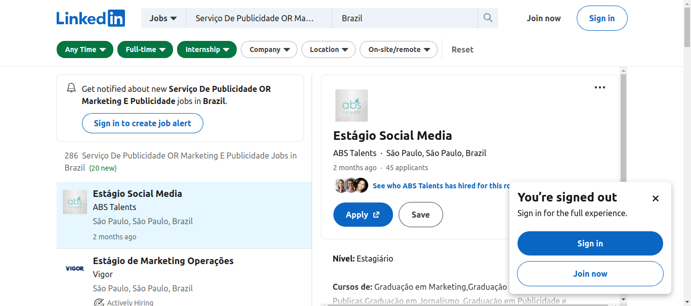

<h1 align="center"> Automação de Vagas (web scraping python)</h1>

Programa de automação do linkedin para busca de serviços de marketing ou publicidade e propaganda, utilizando filtros.

---

  <a href="#-tecnologias">Tecnologias</a>&nbsp;&nbsp;&nbsp;|&nbsp;&nbsp;&nbsp;
  <a href="#-projeto">Projeto</a>&nbsp;&nbsp;&nbsp;|&nbsp;&nbsp;&nbsp;
  <a href="#memo-licença">Licença</a>

 

  

---

## 🚀 Tecnologias

Esse projeto foi desenvolvido com as seguintes tecnologias:

- Python
- Git e Github

---

## 💻 Projeto

Programa de automação do linkedin para busca de serviços de marketing ou publicidade e propaganda, onde faz um filtro  na url da vaga no linkedin, buscando vaga, empresa contratante e sua url, modelo e tipo de contratação, o nível de experiência, número de candidaturas para vaga, a data de sua postagem, o horário do scraping, número de funcionários, de seguidores e local sede da empresa

---

## :memo: Licença

Esse projeto está sob a licença MIT.

---

Feito com ♥ por :wave: [Cristiane](https://www.linkedin.com/in/cristiane-nazareth-dev/)